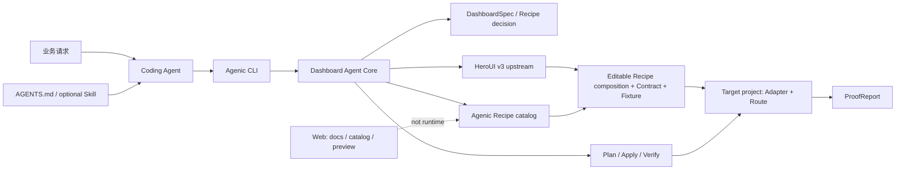

# Agenic CLI-first 基准线

状态：Accepted

基准版本：v1

生效日期：2026-07-28

## 决策

`Agenic` 是面向 Coding Agent 的本地 CLI，不建设自有 MCP Server、远程 Agent
编排器或托管 UI runtime。

CLI 是唯一可执行控制面；Core、Registry、Contract 和 Proof 是产品真相源。Agent
Skill、`AGENTS.md` 和官网只负责发现、说明和展示，不能复制 CLI 的业务实现。

一句话定位：

> 把 Web UI 需求转换成可审查、可选择、可安装、可接数据、可验证的 editable source 交付。

主张保持：

> From request to proof.

## 用户与完成边界

首要用户是在现有 React 项目中工作的 Coding Agent 和开发者。当前已验证的 Dashboard 供应链仍要求 shadcn-compatible 项目；HeroUI Renderer 在端到端 Proof 前属于 Target。
首个完整场景是：

```text
增加经营总览：3 个 KPI、趋势图和服务端分页表格。
先检查项目并生成计划；审查影响后应用，接入一个 Data Adapter，
最后验证真实路由、四态、响应式和项目门禁。
```

只有满足以下条件才算完成：

1. 目标 workspace、技术栈和文件归属可唯一确定。
2. 只选择与请求和项目兼容的 Available Recipe。
3. 写入前有可复核的 plan revision、dry-run 和文件/依赖影响。
4. 业务字段集中在一个 Data Adapter，不散落在页面 JSX。
5. 目标项目的真实前端路由可访问，而不只是 Registry fixture 可构建。
6. `ProofReport` 明确区分 passed、failed 和 unverified。

## 产品架构



### 唯一真相源

| 领域 | 真相源 |
|---|---|
| CLI 行为和退出码 | `packages/dashboard-agent/src` |
| 机器协议 | `packages/dashboard-agent/schemas` 与对应 TypeScript contract |
| 可安装源码 | `packages/registry` |
| Recipe 可用状态 | Recipe Catalog；只有 Available 可以产生安装计划 |
| Agent 使用流程 | 本文档和可选 Skill；不得复制 Core 选择逻辑 |
| 验收结果 | CLI 生成的版本化 `ProofReport` |
| 官网 | 文档、Catalog 和预览，不参与目标项目执行 |

## CLI 契约

公共命令名统一为 `agenic`。`prismo`、`shadcnagent` 与 `dashboard-agent` 在迁移期只作为兼容别名，不再作为公共品牌。

### v0：当前可用

```bash
agenic inspect --cwd <project> --json
agenic plan --cwd <project> --request <text> --json
```

- `inspect`：只读识别单一 shadcn workspace，并读取固定版本的
  `shadcn info --json`。
- `plan`：只读生成 `ProjectProfile + DashboardSpec + RecipeDecision +
  InstallPlan`；当前 `InstallPlan` 只包含 dry-run argv，不执行安装。

### v1：首个交付闭环

以下命令是 Accepted target，在实现和门禁完成前不得标记为 Available：

```bash
agenic preview --plan <plan-file> --json
agenic apply --plan <plan-file> --json
agenic verify --plan <plan-file> --url <route> --json
```

- `preview`：对当前 shadcn-compatible vertical 执行精确 dry-run；HeroUI Renderer 则解析其锁定的上游依赖、Agenic Recipe 文件和冲突，并写入版本化 plan。
- `apply`：校验 plan revision、目标 workspace 和文件摘要后安装源码；未知冲突立即停止。
- `verify`：运行目标项目门禁、Contract/四态检查和真实路由验收，输出 Proof。

CLI 负责确定性执行，Coding Agent 负责：

- 理解自然语言和补齐真正影响交付的未决项。
- 审查 plan，并在获得写入授权后调用 `apply`。
- 在目标项目实现最小 Data Adapter 和 route mount。
- 对不能自动执行的业务、权限和视觉检查标记 `unverified`。

### 输出纪律

- `--json` 时，stdout 只输出符合 schema 的 JSON；诊断写入 stderr。
- 所有成功结果携带 `schemaVersion`。
- 输出不得包含凭据、Token、私有 URL、原始业务底表或直接个人信息。
- 未知值进入 `unresolved`，不得用 fixture 或猜测伪装为生产数据。
- CLI 不自动提交、推送、部署或修改数据库。
- 生成文件默认位于 `.agenic/`，目标项目应将运行产物加入忽略列表；是否提交
  plan 或 proof 由目标项目决定。

### 退出码基准

| 退出码 | 含义 |
|---:|---|
| `0` | 命令成功；plan 已安全选择 |
| `1` | 未分类的执行失败 |
| `2` | 参数或输入 schema 无效 |
| `3` | 需要澄清、用户决策或请求被能力边界拒绝 |
| `4` | workspace / 项目识别失败 |
| `5` | plan 过期、文件摘要变化或写入冲突 |
| `6` | verify 已完成，但存在 failed 检查 |

## 机器协议基准

v1 交付链固定为：

```text
ProjectProfile
  + DashboardSpec
  + RecipeDecision
  → InstallPlan
  → ApplyReceipt
  → ProofReport
```

所有写入动作必须能追溯到一个不可变的 plan：

```text
planId + schemaVersion + planRevision + projectFingerprint + recipeVersion
```

`ApplyReceipt` 至少记录：

- 目标 workspace 和 Recipe 版本。
- changed / created / untouched / conflicted 文件。
- 安装的 package 与 Registry dependency。
- Data Adapter 和 route mount 的完成或未决状态。
- 不含文件正文的前后摘要。

`ProofReport` 至少记录：

- target project 的 typecheck、test 和 production build。
- Contract fixture 和 success/loading/empty/contract-error。
- 375、768、1440 viewport。
- table/filter/pagination 等声明过的核心交互。
- 键盘、语义、横向溢出和图表替代信息基础检查。
- 真实 HTTP route 的状态与浏览器运行结果。
- passed、failed、unverified 三组结果。

## 支持矩阵

### 当前已验证

- Bun workspace。
- React 19 + Rsbuild。
- shadcn-compatible `components.json`。
- 固定 `shadcn@4.14.1` 的 info、dry-run 和 add。
- `dashboard-overview-01` Registry fixture 的 TypeScript、构建和四态。

### 代码可识别但尚未完整验收

- pnpm、yarn、npm。
- Next.js、React Router、TanStack Router 等不同 route mount。
- 真实浏览器交互、响应式和无障碍 Proof。

没有通过独立 fixture 和真实路由验收的组合，不得在 README 或发布说明中宣称支持。

## 发布门禁

每次 CLI、schema、Recipe 或 Skill 发布都必须通过：

```bash
bun run check
bun run skill:validate
bun run proof:install
```

v1 `apply / verify` 发布还必须增加：

1. clean fixture 首次安装。
2. 重复 apply 的幂等验证。
3. 修改目标文件后的冲突拒绝。
4. 过期 plan revision 拒绝。
5. 真实前端 HTTP route 验收。
6. 375、768、1440 浏览器检查。
7. ProofReport schema 与 passed/failed/unverified 分类测试。

## 明确不做

- 不建设或发布 Agenic MCP Server。
- 不建设远程 Agent 编排器或必需的云端 UI runtime。
- 不训练、代理或绑定特定大模型。
- 不把任意 JSX 文本作为核心机器协议。
- 不复制上游 UI 库的品牌、Pro 内容或通用组件发现/安装实现。
- 不在既有项目中擅自替换认证、权限、审计、导出任务、数据库写入或专业 Data Grid；Starter 能力在其独立纵向切片中提供可选模块，支付与商业计费除外。
- 不把 Candidate、概念预览或 Mock 数据表述为可安装生产能力。
- 不为扩充 Catalog 批量制造缺少真实需求和 Proof 的 Recipe。

## 当前优先级

唯一 Active 迭代是关闭 `dashboard-overview-01` 的 CLI 交付闭环：

```text
Inspect → Plan → Preview → Apply → Adapt → Route → Verify → Proof
```

在该链路通过真实目标项目验收之前，不引入第二执行控制面；后续 Blocks、Components、Templates、Full-page、Image 与 Starter 按 [Agenic free-parity boundary](agenic-free-parity-boundary.md) 的顺序推进。
