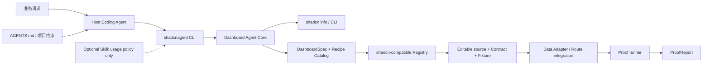

# shadcnagent Dashboard CLI 演进方案

## 产品定义

`shadcnagent` 是一个可被 Codex、Claude Code、Cursor 等 Coding Agent 调用的本地
Dashboard CLI，不是新的基础模型，也不建设自有 MCP Server。

它由五层组成：

1. `DashboardSpec`：把自然语言需求压缩为机器可读的业务意图、组件、数据模式和未决项。
2. CLI：唯一执行控制面，负责 Inspect → Plan → Preview → Apply → Verify。
3. Core：执行确定性项目识别、Recipe 选择、安装计划和验证。
4. Registry：提供版本化、可编辑的源码 Slice、Contract、Fixture 与元数据。
5. Proof / Eval：输出可复核的功能、数据、响应式、无障碍和视觉证据。



## 当前基线

已有能力：

- 一个公开可安装的 `dashboard-overview-01`。
- L2 受控表格、KPI、趋势图、Zod Contract 和四种显式状态。
- 可由 Skills CLI 一键安装的可选 Skill bundle，以及 Inspect → Select → Preview → Install → Adapt → Proof 流程说明。
- `shadcnagent inspect / plan` 可从仓库运行；兼容 Skill bundle 不依赖仓库内部路径。
- Registry build、真实 shadcn dry-run/add、TypeScript 和 Rsbuild Fixture proof。
- 基于 `sidebar-07` 的路由化官网：展示六个 Dashboard 功能组合、Candidate 边界与唯一 Available Recipe 的 dry-run 入口。

当前主要缺口：

- CLI 仍只有只读 `inspect / plan`，尚未实现 revision-safe `apply / verify`。
- `verify-install` 只检查文件存在，尚未产生浏览器、交互、响应式、无障碍和视觉证据。
- 只有一个整页 Recipe，缺少可组合 Slice、Adapter scaffold 与 route integration。
- 官网是确定性 Catalog，不承担已安装 Recipe runtime；浏览器级 Recipe Proof 仍需在统一验证链中补齐。
- 安装组件默认使用 demo fixture 和 success 状态，尚未强制区分“演示可见”与“真实数据已接入”。
- CLI 尚未发布为独立版本化 package。

Accepted 的产品、协议、安全与发布边界见
[CLI-first 基准线](cli-first-baseline.md)；本文只描述演进顺序。

## 目标态的最短交付路径（Phase 1）

当前已完成 Phase 0 的 `inspect` 和 `plan`。以下是 Phase 1 的目标调用，不应在
`preview`、`apply` 和 `verify` 落地前作为可用命令宣传。

支持范围内的目标调用只有两轮：

```bash
shadcnagent plan \
  --cwd . \
  --request "增加经营总览：3 个 KPI、趋势图、服务端分页表格" \
  --json
```

Agent 审查 plan 后执行：

```bash
shadcnagent preview --plan .shadcnagent/plans/<plan-id>.json --json
shadcnagent apply --plan .shadcnagent/plans/<plan-id>.json --json
shadcnagent verify --plan .shadcnagent/plans/<plan-id>.json --url /dashboard --json
```

`plan` 必须一次返回：

- `ProjectProfile`：真实项目目录、包管理器、shadcn info、router、scripts 和风险。
- `DashboardSpec`：widgets、data mode、table level、states、route 和未决项。
- `RecipeDecision`：评分、能力差距、选择或 clarify/reject 原因。
- `InstallPlan`：固定 Registry URL、精确 argv、文件/依赖影响和 adapter seam。

`verify` 必须返回：

- typecheck、test、build。
- Contract fixture 与 success/loading/empty/error。
- 375、768、1440 viewport。
- 核心 table/filter/pagination/drill-down 交互。
- 键盘、语义、横向溢出和图表替代文本基础检查。
- screenshot 与 visual diff（只作为回归证据，不作为唯一门禁）。
- passed、failed、unverified 分组。

## 机器协议

### DashboardSpec v1

首版只表达 Agent 能可靠判断的内容：

```json
{
  "schemaVersion": "1",
  "request": "增加经营总览",
  "intent": "overview",
  "widgets": ["metric-grid", "trend-chart", "data-table"],
  "dataMode": "server",
  "tableLevel": "L2",
  "states": ["success", "loading", "empty", "contract-error"],
  "unresolved": ["route", "data-source-contract"]
}
```

未知值必须进入 `unresolved`，不能由 Agent 静默猜测。业务指标口径、权限和真实 API schema 不属于 Recipe 默认值。

### Recipe Manifest

每个 Recipe 除 shadcn Registry item 外，还应声明：

- `status`、`version`、`capabilities`、`tableLevel`。
- 支持的 framework/base/Tailwind 范围。
- Contract schema、Fixture、状态矩阵。
- owned files、adapter slots、route slots。
- preview URL / screenshot。
- verify assertions。

选择顺序固定为：`Available filter → compatibility gate → capability score → domain conflict gate → decision`。Candidate 可以解释差距，但永远不能生成安装计划。

## 分阶段推进

### Phase 0：Agent-readable Plan（Completed）

目标：消除误选和项目误判，让 Agent 一条命令得到可靠计划。

- 建立 `@shadcnagent/cli`，公共 bin 为 `shadcnagent`。
- `inspect` 自动定位单一 shadcn workspace；多 workspace 明确拒绝猜测。
- 项目真相源切换到固定版本的 `shadcn info --json`。
- `plan` 输出 DashboardSpec v1、RecipeDecision 和只读 dry-run argv。
- 为 monorepo、Candidate 冲突和安装命令增加确定性测试。
- 修正文档中 L0/L2 漂移。

完成状态：目标 fixture、当前 monorepo、Agent Ops 误选回归和根 `check` 已通过。

### Phase 1：One-command Delivery

目标：支持范围内从需求到可运行页面不超过两次 Agent 决策。

- `preview` 执行 shadcn dry-run，并保存 `.shadcnagent/plans/<plan-id>.json`。
- `apply` 校验 plan revision、project fingerprint 和文件摘要后安装；未知文件冲突立即停下。
- 提供 REST / fixture Adapter scaffold 和常见 router mount。
- 将 demo fixture 改成显式 opt-in，生产接入缺少数据时不得呈现为 success。
- `verify` 执行项目命令、Contract 和四态测试，生成标准 ProofReport。
- 每次运行保存 ApplyReceipt、changed / untouched / conflicted 和 manual verification report。
- `verify` 必须验收真实前端 HTTP route，不能只验证 Registry fixture 或构建。

完成门槛：3 个真实目标仓库 fixture 的首次安装成功率不低于 95%，失败有明确分类且可重放。

### Phase 2：Composable Dashboard

目标：从一个整页 Block 演进为受控组合，不退回自由生成。

- 增加 metric、chart、filter-bar、L1/L2 table、detail-panel Slice。
- Recipe Manifest 增加 compatibility、ownership 和 composition slots。
- 增加 Sales 或 Agent Ops 中有真实需求证据的第一个 Available Recipe。
- 建立 golden requests、clarify/reject、selection precision 和 visual regression eval。

完成门槛：组合结果保持单一数据映射点，无重复 layout/runtime，eval 可阻止错误 Recipe 发布。

### Phase 3：CLI Distribution

目标：让不同 Coding Agent 宿主直接调用同一版本化 CLI。

- 发布带 `shadcnagent` bin 的独立 CLI package。
- 可选 Skill 和 `AGENTS.md` 只描述使用策略，依赖同版本 CLI contract。
- 为声明支持的宿主运行相同 fixture 和真实路由验收。
- 支持 Registry namespace / private Registry；认证由 shadcn 配置承载。
- 可选接入 v0 做视觉探索，结果仍需回到本地 plan 和 proof。

只有 CLI contract 和错误模型稳定后才进入本阶段。

## 成功指标

| 指标 | 首阶段目标 |
|---|---|
| Time to first valid plan | warm p50 ≤ 30 秒 |
| Time to first runnable preview | 已初始化项目 p50 ≤ 2 分钟 |
| Time to proof | 已支持场景 p50 ≤ 8 分钟 |
| Agent 决策轮次 | ≤ 2 |
| Available Recipe 误选率 | < 2% |
| 安装成功率 | ≥ 95% |
| Proof 完整性 | 所有未执行项显式列为 unverified |

速度不能以误装 Candidate、猜测 API、跳过错误/空状态或把 build 当成完整验收为代价。

## 不做什么

- 不训练或绑定特定大模型。
- 不复制 shadcn 的通用 project info、registry search 或 install 实现。
- 不建设 shadcnagent MCP Server、云端编排器或必需的托管 UI runtime。
- 不让模型直接输出任意 JSX 作为核心协议。
- 不为没有真实需求和 eval 的场景批量制造 Recipe。
